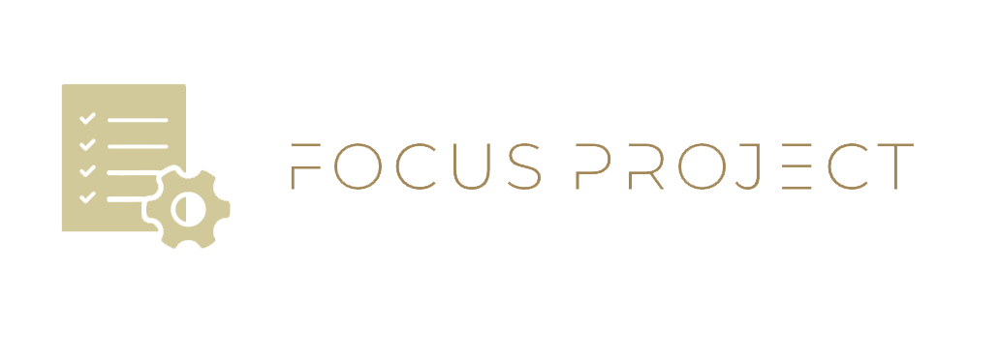

# FocusProject

  

  Progetto per il corso di Ingegneria del Software del Dipartimento di Informatica,
   
  presso l'Università degli Studi di Salerno (anno accademico 2023/2024),
   
  tenuto dal professore Andrea De Lucia.

## Descrizione

**FocusProject** è un'applicazione web che si propone di migliorare la gestione delle Risorse Umane in ambito aziendale, al fine di ottimizzare l'organizzazione e la comunicazione del personale.

## Membri

* Kevin Paladino (https://github.com/kevin011602)
* Andrea Landolfi (https://github.com/Andreal24)
* Salvatore Martire (https://github.com/smartire1)
